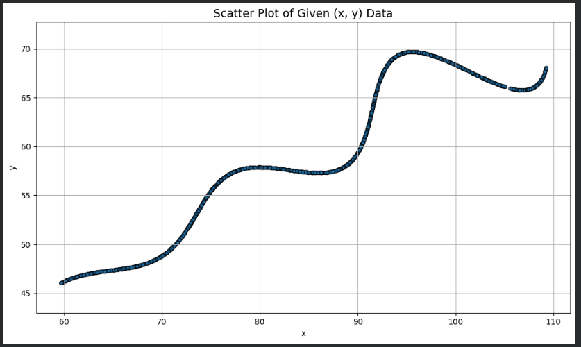
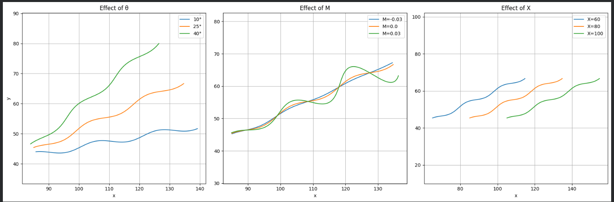
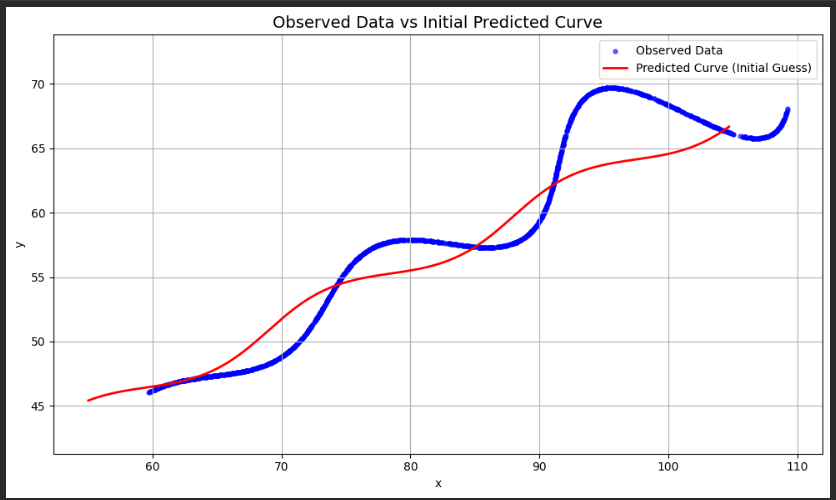
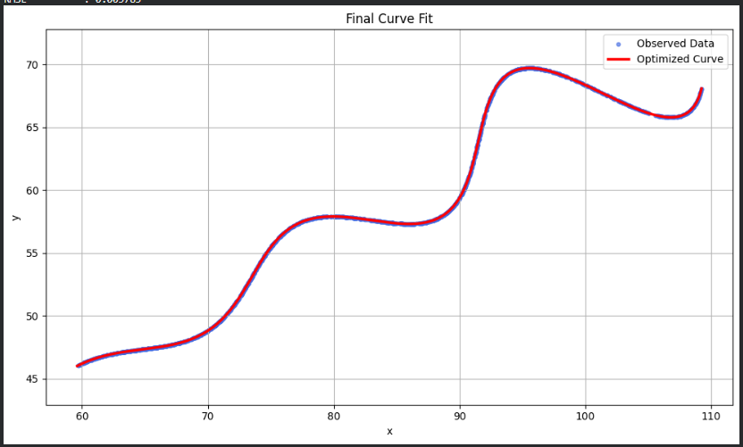

# AI R&D Assignment - Parametric Curve Parameter Estimation

## Project Outline

The goal of this project is to estimate unknown parameters of a parametric curve using a dataset of 1500 co-ordinate points.

The following unidentified parameters need to be estimated:
- θ (Theta)
- M
- X

The solution was developed in Python by analysing the data set, implementing a mathematical model, creating an optimization target, and estimating unknown parameters by numerical optimization.

## Problem Statement

The given parametric equations are:

```text
x = t*cos(theta) - exp(M*|t|)*sin(0.3*t)*sin(theta) + X

y = 42 + t*sin(theta) + exp(M*|t|)*sin(0.3*t)*cos(theta)
```

where

6 < t < 60

The unknown parameters are:

- θ (Theta)
- M
- X

The aim is to estimate these parameters in such a way that the predicted curve is close to the data set.

## Dataset

The provided dataset (`xy_data.csv`) contains **1500** coordinate points with two columns:
- x
- y

These points are samples of the parametric curve that is unknown.

Before optimization, the dataset was checked for:
- Missing values
- Duplicate records
- Data types
- Summary statistics

There was no need for preprocessing because the dataset was deemed to be clean.

## Workflow

The following procedure has been followed for the estimation of unknown parameters:

1. Load the dataset.
2. Perform data quality checks.
3. Visualize the given curve.
4. Implement the parametric equations.
5. Analyze the effect of each unknown parameter.
6. Define the initial parameter values and bounds.
7. Generate a dense predicted curve.
8. Construct an L1-based objective function using KDTree.
9. Optimize the unknown parameters using the L-BFGS-B algorithm.
10. Validate the optimized model using numerical metrics and visual comparison.

## Libraries

The project has been implemented with the following library(s) in Python:
| Library | Purpose |
|----------|---------|
| NumPy | Mathematical computations |
| Pandas | Data loading and analysis |
| Matplotlib | Data visualization |
| SciPy | Optimization and KDTree implementation |

## Results

After optimization, the estimated parameters are:
| Parameter | Estimated Value |
|-----------|----------------:|
| θ (Theta) | 29.999947° |
| M | 0.02999992 |
| X | 54.99994582 |

### Model Evaluation

| Metric | Value |
|--------|-------:|
| L1 Error | 4.849061 |
| Mean Error | 0.003233 |
| Maximum Error | 0.009295 |
| RMSE | 0.003785 |

The estimated parameters correctly reconstruct the given parametric curve, as evidenced by the optimized curve's close overlap with the observed dataset.

## Output Visualizations

### Scatter Plot of the Given Dataset



---

### Parameter Sensitivity Analysis



---

### Initial Predicted Curve



---

### Final Optimized Curve



## Conclusion
This project successfully estimates unknown parameters of a parametric curve by applying numerical optimization to the curve.

The workflow includes data exploration, visualization, mathematical modelling, analysis of parameter sensitivity, optimization and validation.

The optimized curve is very close to the observed data, which shows that the estimated parameters are accurately approximating the original curve.
